# LAPORAN PRAKTIKUM
## Pemrograman Web Lanjut

Marsyalia Fernanda  
244107020133  
TI-2F

## JOBSHEET 5.1

### 1. Topik: Instalasi dan Setup Filament PHP v4 pada Laravel 11

---

## E. Analisis & Diskusi

### 1. Apa kelebihan Filament dibanding membuat admin panel manual?

Filament menyediakan komponen UI yang sudah jadi seperti tabel, form, widget, dan navigasi sidebar sehingga developer tidak perlu membangun semuanya dari nol. Proses pembuatan admin panel yang biasanya memakan waktu berhari-hari bisa diselesaikan dalam hitungan menit. Selain itu tampilan yang dihasilkan sudah responsif dan konsisten tanpa perlu menulis CSS secara manual.

### 2. Mengapa Filament menggunakan Livewire?

Livewire memungkinkan halaman admin bersifat interaktif secara real-time, seperti pencarian langsung, filter tabel, dan pagination, tanpa harus menulis JavaScript. Semua komunikasi antara browser dan server ditangani otomatis oleh Livewire, sehingga developer cukup fokus menulis logika di sisi PHP saja.

### 3. Apa perbedaan SQLite dan MySQL dalam development?

SQLite tidak memerlukan instalasi server terpisah karena database disimpan dalam satu file `.sqlite`, sehingga cocok untuk pengembangan awal yang cepat. MySQL membutuhkan server database tersendiri seperti XAMPP, namun lebih handal untuk aplikasi production karena mendukung banyak koneksi secara bersamaan dan pengelolaan data yang lebih kompleks.

### 4. Apa fungsi Panel Builder?

Panel Builder adalah fitur Filament yang secara otomatis membuat kerangka admin panel lengkap hanya dengan satu perintah `php artisan filament:install --panels`. Fitur ini menghasilkan routing, layout, sistem autentikasi, dan navigasi sidebar secara otomatis sehingga admin panel langsung bisa digunakan tanpa konfigurasi tambahan.

---

## F. Tugas Praktikum

### Screenshot Halaman Login

> _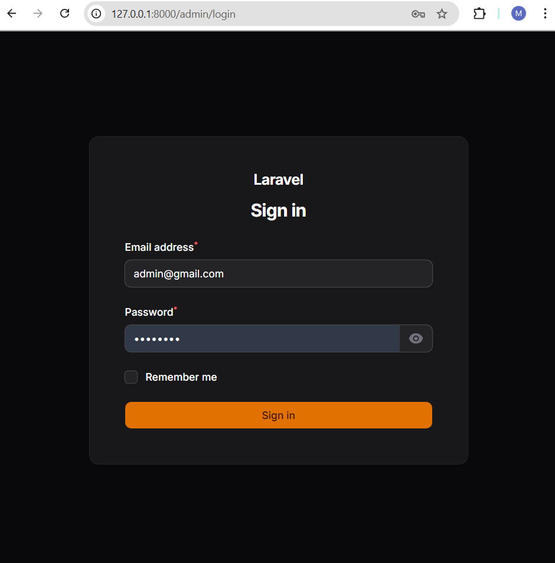_
---

### Screenshot Dashboard

> _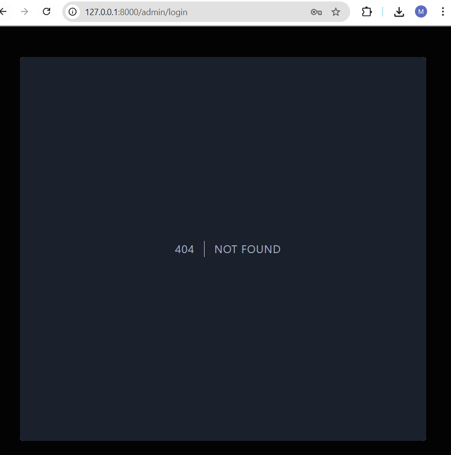_

---

### Screenshot Data 2 User di Database

> _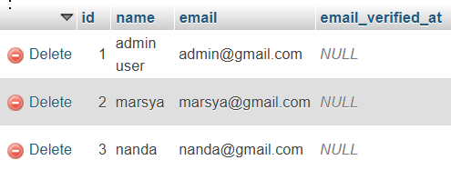_

---

## Kendala dan Solusi

| No | Kendala | Solusi |
|---|---|---|
| 1 | Ekstensi `ext-intl` dan `ext-zip` belum aktif sehingga Filament gagal diinstall | Mengaktifkan kedua ekstensi tersebut di file `php.ini` XAMPP lalu restart Apache |
| 2 | Error `Unknown collation: utf8mb4_0900_ai_ci` saat membuka halaman admin | Menambahkan `DB_COLLATION=utf8mb4_unicode_ci` di file `.env` karena versi MySQL XAMPP tidak mendukung collation tersebut |
| 3 | Laravel yang terinstall versi 13 sehingga konflik dengan Filament v4 | Menggunakan perintah `composer create-project laravel/laravel:"^11.0"` untuk memaksa instalasi Laravel versi 11 |

## JOBSHEET 5.2
### Topik: Membuat CRUD Resource dengan Filament v4
 
---

### Membuat Resource User
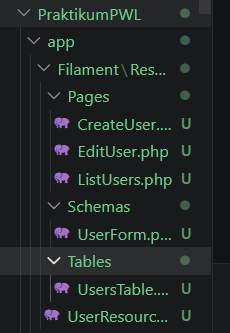

### Menjalankan Aplikasi
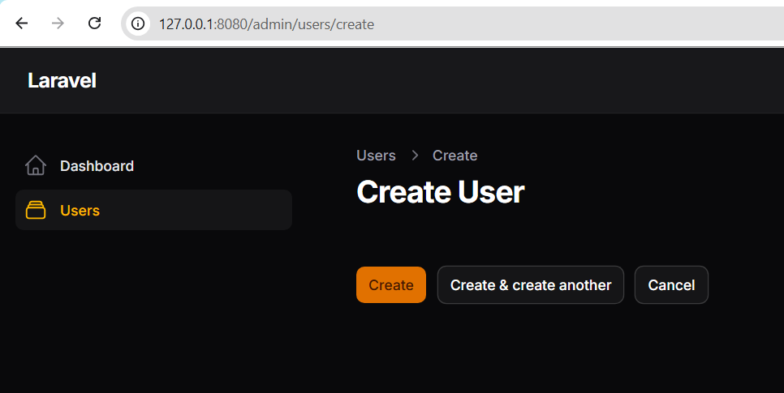

### Membuat Form User
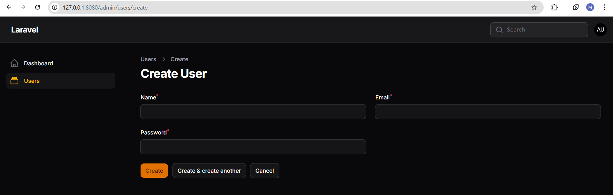

### Cek DB hasil create user
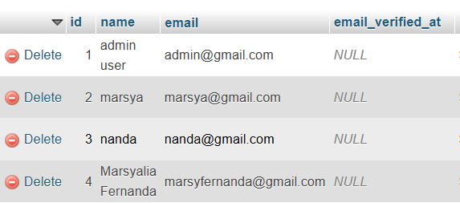

### Menampilkan Data User
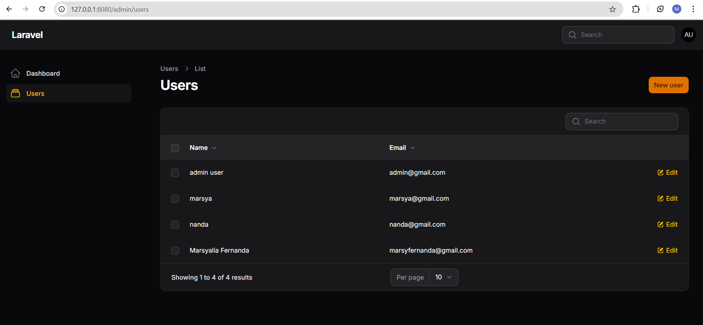

### Mengubah icon
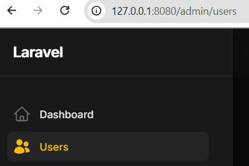
 
## I. Analisis & Diskusi
 
### 1. Mengapa Filament dapat membuat CRUD tanpa banyak coding?
 
Filament menggunakan konsep Resource yang secara otomatis menghasilkan halaman List, Create, dan Edit hanya dari satu perintah `php artisan make:filament-resource`. Filament sudah menyediakan Form Builder dan Table Builder yang tinggal dikonfigurasi, sehingga developer tidak perlu menulis logika CRUD dari nol maupun membuat tampilan secara manual.
 
### 2. Apa perbedaan Form Schema dan Table Schema?
 
Form Schema digunakan untuk mendefinisikan field input pada halaman Create dan Edit, seperti TextInput untuk nama, email, dan password. Table Schema digunakan untuk mendefinisikan kolom yang ditampilkan pada halaman List, seperti kolom name, email, dan created_at beserta fitur searchable dan sortable-nya.
 
### 3. Bagaimana jika kita ingin menambahkan validasi email unik?
 
Cukup menambahkan method `->unique(ignoreRecord: true)` pada field email di `UserForm.php`. Parameter `ignoreRecord: true` diperlukan agar validasi tidak bentrok saat mengedit data yang sudah ada, karena email yang sama milik record itu sendiri tidak dianggap duplikat.
 
### 4. Mengapa password tidak perlu kita hash manual?
 
Karena model `User` di Laravel sudah memiliki casting `'password' => 'hashed'` secara bawaan. Artinya setiap kali field password diisi dan disimpan ke database, Laravel otomatis melakukan hashing menggunakan algoritma bcrypt tanpa perlu memanggil `Hash::make()` secara manual.
 
---
 
## J. Tugas Praktikum
 
### Screenshot Halaman List Users
 

 
### Screenshot Halaman Create User
 

 
### Screenshot Data User di Database
 

 
---
 
## Kendala dan Solusi
 
| No | Kendala | Solusi |
|---|---|---|
| 1 | Error `Cannot declare class UserForm` karena ada duplikat file | Menghapus folder `app\Filament\Resources` yang lama menggunakan perintah `Remove-Item -Recurse -Force app\Filament\Resources` lalu menjalankan `composer dump-autoload` |
| 2 | Halaman `/admin` menampilkan 404 Not Found | Memastikan perintah dijalankan di dalam folder `PraktikumPWL` bukan di folder `PWL`, lalu menjalankan ulang `php artisan serve` |

## JOBSHEET 5.3
### Topik: Membuat Migration, Model, Relasi & Resource Category
 
---
 
### Hasil langkah 1
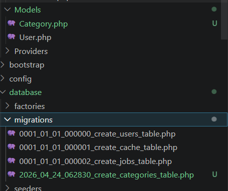

### Hasil langkah 2
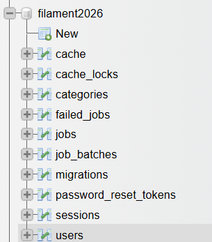

### Hasil langkah 4
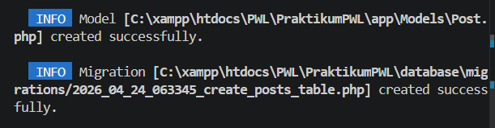

### Hasil langkah 5
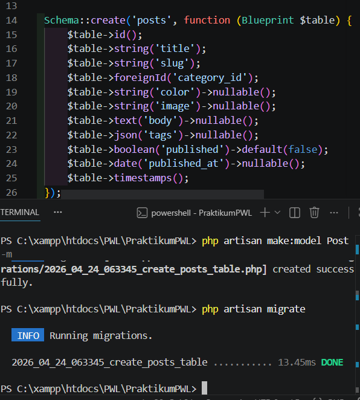

### Membuat Resource Category
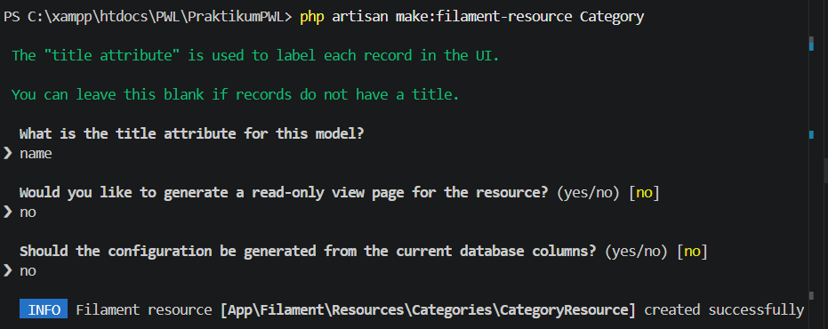

### Tampilan Create Category
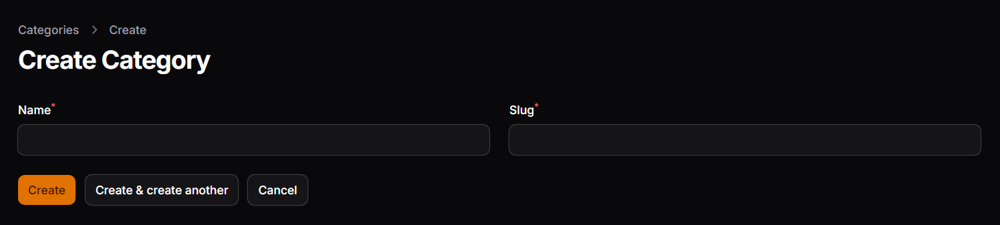

### Tampilan List Category
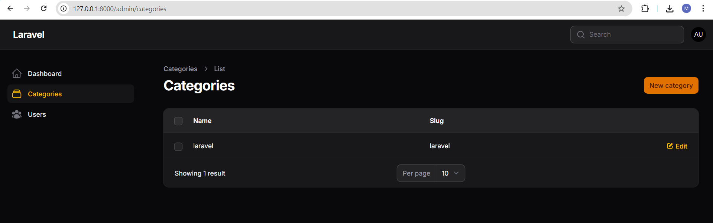

## J. Analisis & Diskusi
 
### 1. Mengapa kita perlu $fillable?
 
`$fillable` berfungsi untuk menentukan kolom mana saja yang boleh diisi secara mass assignment, yaitu ketika data dikirim sekaligus dalam bentuk array seperti yang dilakukan Filament saat menyimpan form. Tanpa `$fillable`, Laravel akan menolak penyimpanan data dan melempar `MassAssignmentException` sebagai perlindungan dari serangan injeksi data.
 
### 2. Apa fungsi $casts pada Laravel?
 
`$casts` digunakan untuk mengonversi tipe data kolom database secara otomatis saat dibaca maupun disimpan. Misalnya kolom `tags` bertipe JSON di database akan otomatis dikonversi menjadi array PHP, kolom `published` dikonversi menjadi `true`/`false`, dan kolom `published_at` dikonversi menjadi objek Carbon sehingga bisa diformat dan dimanipulasi tanpa perlu konversi manual.
 
### 3. Apa perbedaan integer biasa dengan foreign key?
 
Integer biasa hanya menyimpan angka tanpa hubungan apapun dengan tabel lain. Foreign key adalah integer yang secara eksplisit mereferensi kolom `id` di tabel lain, sehingga database bisa memvalidasi bahwa nilai yang dimasukkan benar-benar ada di tabel tujuan. Foreign key juga memungkinkan pengaturan perilaku saat data induk dihapus, seperti `cascade` atau `restrict`.
 
### 4. Bagaimana jika category dihapus tetapi masih ada post?
 
Jika tidak ada foreign key constraint, data post akan tetap ada dengan `category_id` yang sudah tidak valid (orphan record). Jika menggunakan foreign key dengan `onDelete('restrict')`, penghapusan category akan gagal selama masih ada post yang mereferensikannya. Jika menggunakan `onDelete('cascade')`, semua post yang berelasi akan ikut terhapus secara otomatis.
 
---
 
## K. Tugas Praktikum
 
### Screenshot Struktur Tabel di Database
 
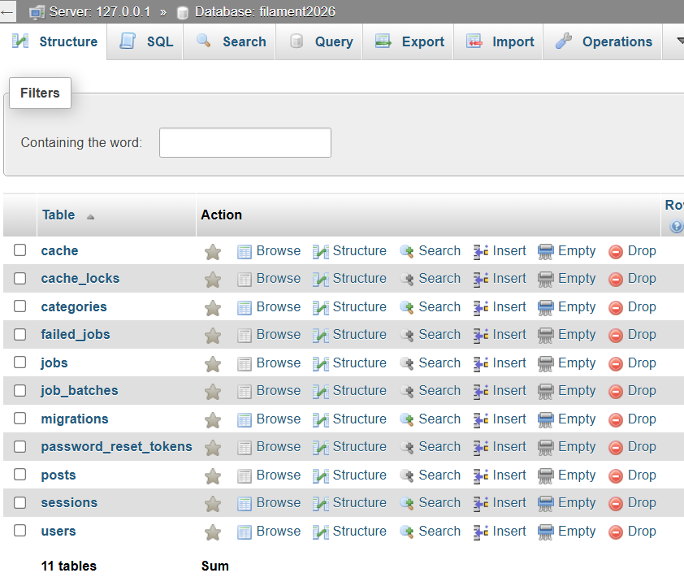

 
### Screenshot Form Category (dengan validasi slug unik)
 
> _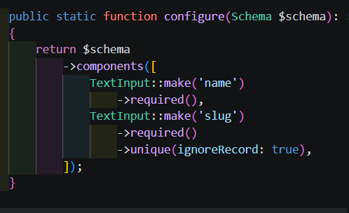_
 
### Screenshot List Category (minimal 3 kategori)
 
> _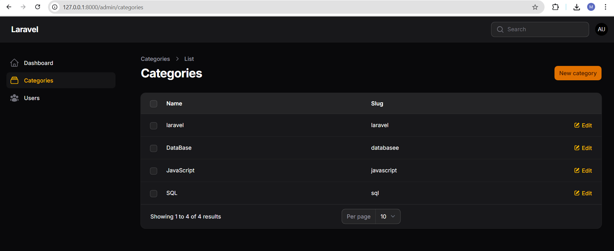_
 
---
 
## Kendala dan Solusi
 
| No | Kendala | Solusi |
|---|---|---|
| 1 | Error `Target class [App\Models\Category] does not exist` saat menjalankan relasi | Memastikan namespace model sudah benar dan menjalankan `composer dump-autoload` |
| 2 | Validasi `->unique()` pada slug tetap lolos duplikat saat edit | Menambahkan parameter `ignoreRecord: true` agar validasi mengabaikan record yang sedang diedit |
| 3 | Foreign key gagal ditambahkan karena tabel `posts` sudah dibuat tanpa constraint | Membuat migration baru dengan `php artisan make:migration add_foreign_key_to_posts_table` dan menambahkan `$table->foreign('category_id')->references('id')->on('categories')->onDelete('cascade')` |

## JOBSHEET 6.1
### Topik: Implementasi Form Elements & Resource Post di Filament
 
---
 
### Membuat Resource Post
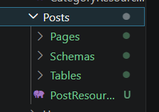
 
### Tampilan Form Create Post (semua elemen)
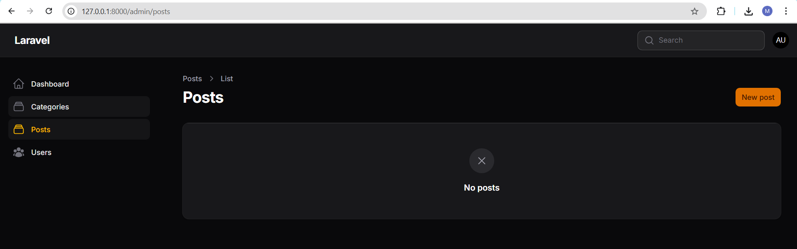
 
### Tampilan Create Post
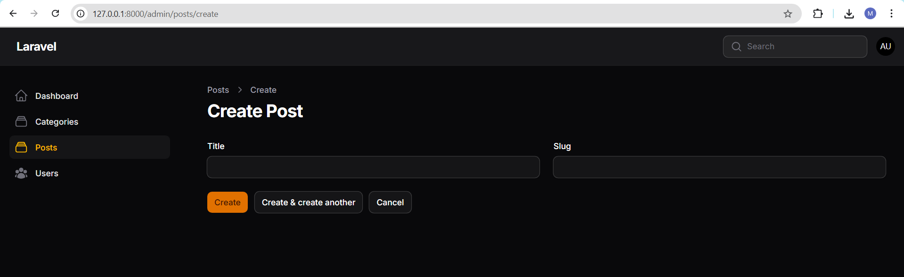
 
### Select dari tabel category
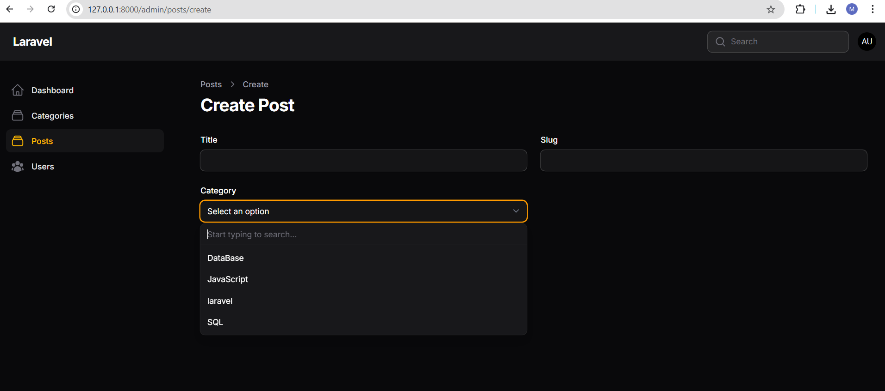

### Color Picker
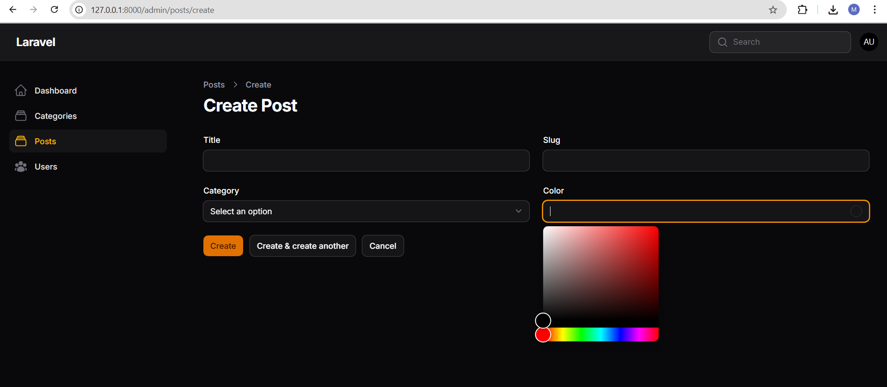
 
### Markdown
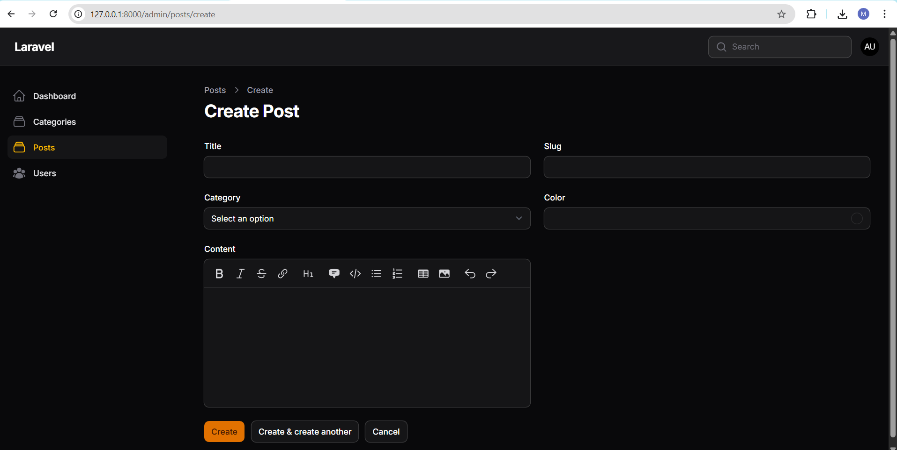

### RichEditor
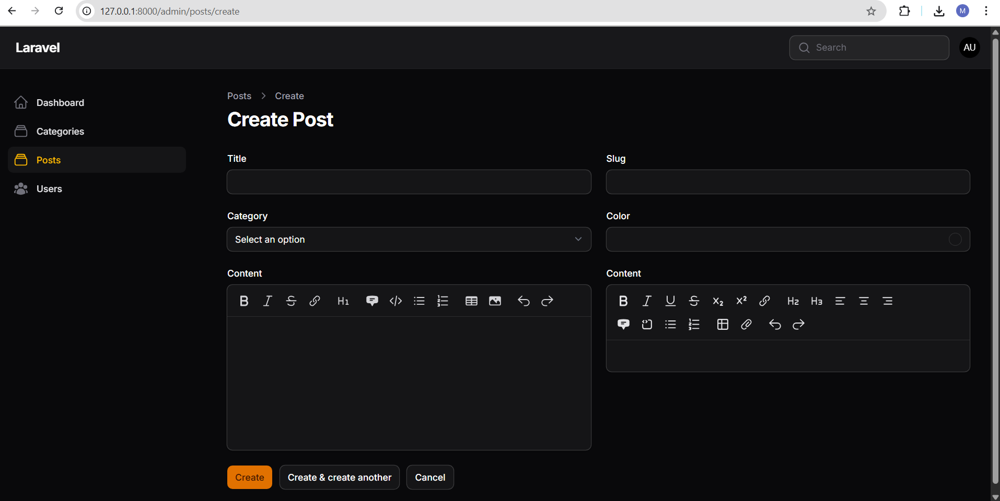
 
### File Upload
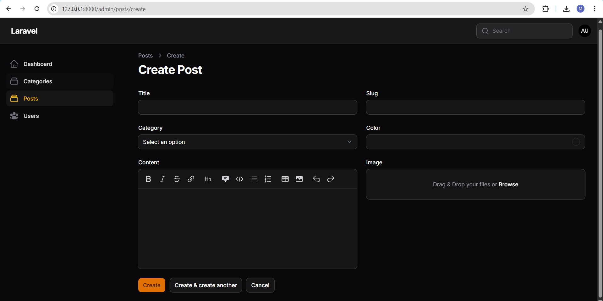
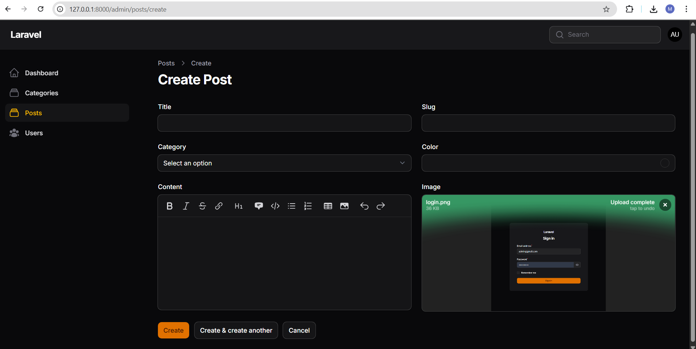

### Tags Input
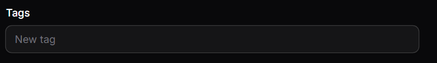

### Checkbox

 
### Date Picker
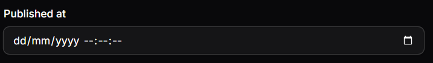

---
 
## I. Analisis & Diskusi
 
### 1. Mengapa kita perlu storage:link?
 
Laravel menyimpan file upload di folder `storage/app/public`, sedangkan web server hanya bisa mengakses folder `public`. Perintah `php artisan storage:link` membuat symbolic link dari `public/storage` ke `storage/app/public`, sehingga gambar yang diupload bisa diakses melalui URL browser tanpa perlu memindahkan file secara manual.
 
### 2. Apa fungsi $casts untuk field JSON?
 
Field bertipe JSON di database disimpan sebagai string teks. Dengan menambahkan `'tags' => 'array'` pada `$casts`, Laravel otomatis mengkonversi string JSON tersebut menjadi array PHP saat dibaca, dan mengkonversi array kembali menjadi JSON saat disimpan. Ini memungkinkan kita bekerja langsung dengan array di PHP tanpa perlu memanggil `json_decode()` atau `json_encode()` secara manual.
 
### 3. Mengapa kita menggunakan category.name bukan category_id?
 
`category_id` hanya menampilkan angka ID yang tidak bermakna bagi pengguna admin. Dengan menggunakan `category.name`, Filament mengakses relasi `belongsTo` yang sudah dibuat pada model Post dan menampilkan nama category yang sebenarnya. Ini memanfaatkan Eloquent eager loading sehingga data relasi diambil secara efisien sekaligus.
 
### 4. Apa perbedaan RichEditor dan MarkdownEditor?
 
RichEditor menampilkan toolbar dengan tombol format (bold, italic, list, tabel, gambar) dan hasilnya disimpan dalam format HTML, sehingga cocok untuk konten yang akan langsung dirender sebagai HTML. MarkdownEditor menggunakan sintaks Markdown dan hasilnya disimpan sebagai teks Markdown mentah, sehingga lebih ringan dan cocok jika konten perlu diproses atau diubah format di kemudian hari.
 
---
 
## J. Tugas Praktikum
 
### Screenshot Form Create Post
 

 
### Screenshot Tabel Post
 
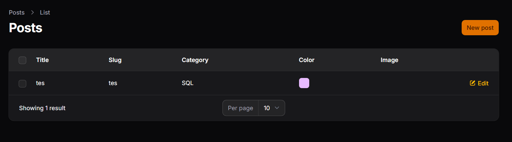
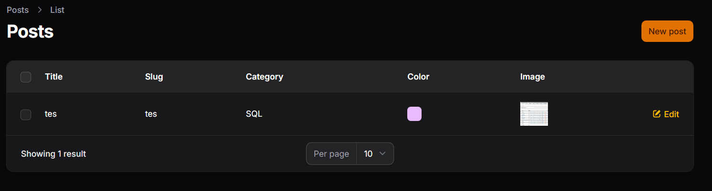
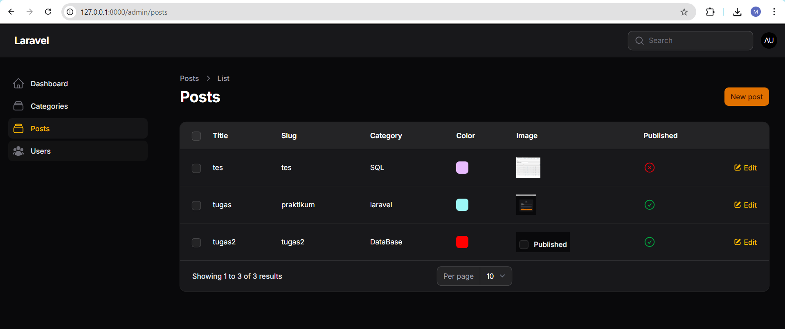
 
### Screenshot Struktur Folder Storage
 
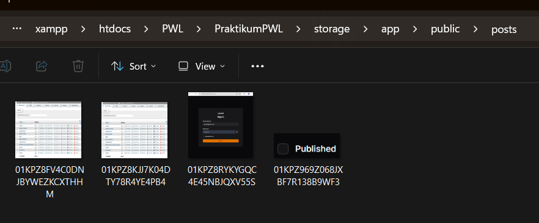
 
---
 
## Kendala dan Solusi
 
| No | Kendala | Solusi |
|---|---|---|
| 1 | Gambar tidak muncul di tabel meskipun sudah diupload | Menjalankan `php artisan storage:link` dan memastikan nama field `image` di `PostForm.php` dan `PostsTable.php` sama persis |
| 2 | Select category tidak menampilkan data | Memastikan relasi `belongsTo(Category::class)` sudah ada di model Post dan menggunakan `->relationship('category', 'name')` bukan `->options()` |
| 3 | Error saat menyimpan field tags | Memastikan `'tags' => 'array'` sudah ada di `$casts` pada model Post karena field bertipe JSON |

## JOBSHEET 6.2
### Topik: Custom Layout Form dengan Section & Group di Filament
 
## I. Analisis & Diskusi
 
### 1. Mengapa layout form penting dalam aplikasi admin?
 
Layout form yang baik membantu admin membaca dan mengisi data lebih cepat karena field yang berhubungan dikelompokkan secara logis. Form yang tidak terstruktur dengan field berjejer panjang ke bawah memaksa pengguna untuk banyak scroll dan sulit menemukan field tertentu. Dengan Section dan Group, admin panel terlihat lebih profesional dan mengurangi kemungkinan kesalahan input.
 
### 2. Apa perbedaan Section dan Group?
 
Section menampilkan kotak visual dengan judul, deskripsi, dan icon yang terlihat oleh pengguna, sehingga cocok untuk mengelompokkan field yang memiliki kategori berbeda seperti "Post Details" dan "Meta Information". Group tidak memiliki tampilan visual apapun dan hanya berfungsi sebagai wadah pengatur layout, misalnya untuk mengatur beberapa Section agar tersusun dalam satu baris kolom.
 
### 3. Kapan kita menggunakan columnSpanFull()?
 
`columnSpanFull()` digunakan ketika sebuah field perlu mengambil seluruh lebar form terlepas dari berapa kolom yang sedang digunakan. Ini paling berguna untuk field seperti MarkdownEditor atau RichEditor yang membutuhkan ruang lebar agar nyaman digunakan, sementara field lain di sekitarnya tetap menggunakan layout multi-kolom.
 
### 4. Apa keuntungan sistem grid 12 kolom?
 
Sistem grid 12 kolom memungkinkan pembagian lebar yang sangat fleksibel karena angka 12 memiliki banyak faktor pembagi: 1, 2, 3, 4, 6, dan 12. Ini berarti kita bisa membuat layout 1/2, 1/3, 1/4, 2/3, dan kombinasinya tanpa angka desimal. Filament mengadopsi sistem ini dari Tailwind CSS sehingga layoutnya konsisten dengan standar web modern.
 
---
 
## J. Tugas Praktikum
 
### Screenshot Form sebelum layout
 

 
### Screenshot Form sesudah layout (2/3 - 1/3)
 
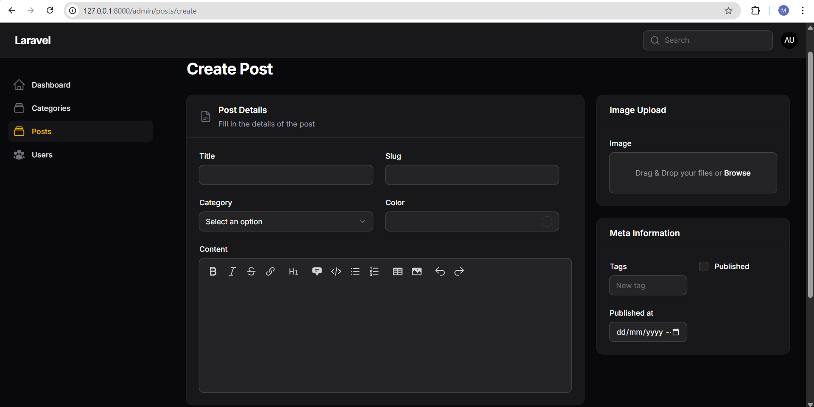
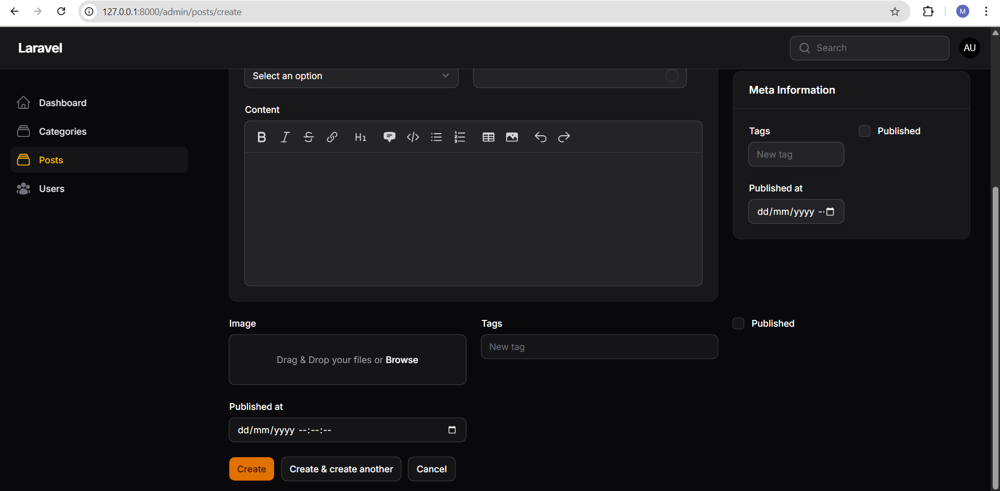
 
---
 
## Kendala dan Solusi
 
| No | Kendala | Solusi |
|---|---|---|
| 1 | Section tidak muncul setelah menambahkan `use` statement | Memastikan menggunakan `use Filament\Schemas\Components\Section` bukan `use Filament\Forms\Components\Section` karena Filament v4 memisahkan namespace-nya |
| 2 | Layout `columns(3)` tidak terbagi rata, Section masih memanjang ke bawah | Menambahkan `->columnSpan(2)` pada Group kiri dan `->columnSpan(1)` pada Group kanan sesuai proporsi yang diinginkan |
| 3 | Field MarkdownEditor mengacaukan layout grid | Menambahkan `->columnSpan(2)` pada MarkdownEditor agar lebarnya mengikuti lebar Section, bukan mengecil menjadi 1 kolom |
 
---

## JOBSHEET 6.3
### Topik: Implementasi Form Validation pada Filament
 
---
 
## K. Analisis & Diskusi
 
### 1. Mengapa validasi penting pada admin panel?
 
Validasi memastikan data yang masuk ke database selalu dalam format dan nilai yang benar, sehingga mencegah data rusak atau tidak konsisten. Tanpa validasi, admin bisa saja menyimpan title yang kosong, slug yang duplikat, atau gambar yang tidak diupload, yang kemudian bisa menyebabkan error saat data tersebut ditampilkan di halaman publik.
 
### 2. Apa perbedaan validasi client-side dan server-side?
 
Validasi client-side berjalan di browser menggunakan JavaScript dan memberikan feedback instan tanpa perlu mengirim data ke server, namun bisa dilewati oleh pengguna yang menonaktifkan JavaScript. Validasi server-side berjalan di server dan tidak bisa dilewati oleh apapun karena data harus melewatinya sebelum disimpan. Filament menggunakan validasi server-side berbasis Laravel, sehingga data yang masuk dijamin sudah tervalidasi meskipun browser dimanipulasi.
 
### 3. Mengapa unique otomatis bekerja saat edit data?
 
Filament secara otomatis menambahkan parameter `ignoreRecord` saat mode edit, sehingga validasi unique akan mengabaikan record yang sedang diedit. Ini mencegah error saat pengguna menyimpan data tanpa mengubah slug, karena slug milik record itu sendiri tidak dianggap duplikat oleh database.
 
### 4. Kapan kita perlu menggunakan rules array dibanding string?
 
Format string dengan pipe seperti `'required|min:3|max:50'` lebih ringkas untuk aturan yang sederhana. Format array seperti `['required', 'min:3', 'max:50']` lebih disarankan ketika salah satu rule membutuhkan parameter kompleks, menggunakan Rule object dari Laravel seperti `Rule::unique()`, atau ketika aturan validasi panjang dan perlu dibaca dengan mudah.
 
---
 
## L. Tugas Praktikum
 
### Screenshot Error required
 
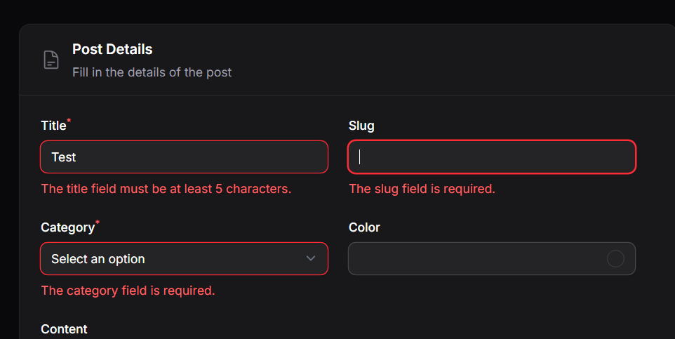
 
### Screenshot Error min length
 
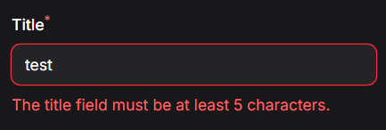
 
### Screenshot Error unique
 
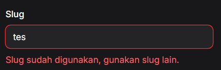
 
---
 
## Kendala dan Solusi
 
| No | Kendala | Solusi |
|---|---|---|
| 1 | Validasi `->unique()` tetap error saat mengedit post yang sudah ada | Mengganti `->unique()` dengan `->unique(ignoreRecord: true)` agar validasi tidak menolak slug milik record yang sedang diedit |
| 2 | Pesan error `->validationMessages()` tidak muncul, tetap menggunakan pesan default | Memastikan key yang digunakan di dalam array sesuai dengan nama rule-nya, misalnya `'unique'` bukan `'Slug'` |
| 3 | Validasi `required` pada FileUpload menyebabkan error saat mengedit post karena gambar tidak diupload ulang | Menghapus `->required()` dari FileUpload dan mengandalkan validasi hanya saat Create dengan menambahkan kondisi menggunakan `->requiredWithout()` atau menggunakan `->hiddenOn('edit')` |

---

## JOBSHEET 7
### Topik: Implementasi Wizard Form (Multi Step FOrm)
 
### Membuat Products Table
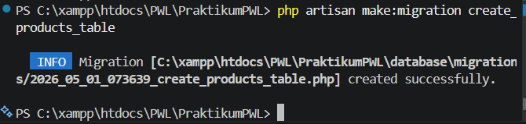

### Tampilan Table Database
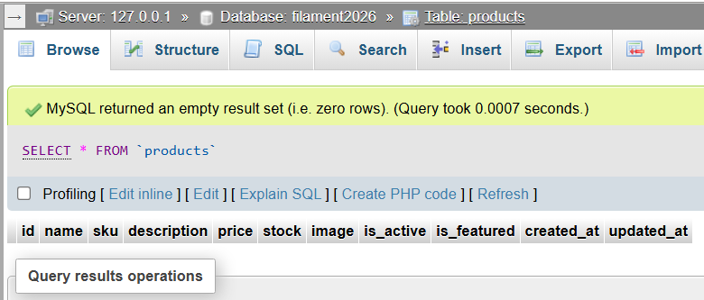

### Membuat Model Product
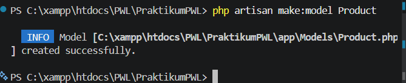

### Membuat Resource Product
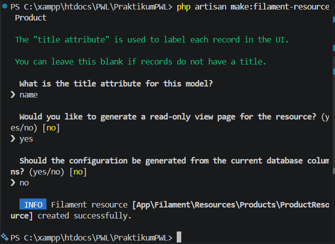

### Tampilan /product
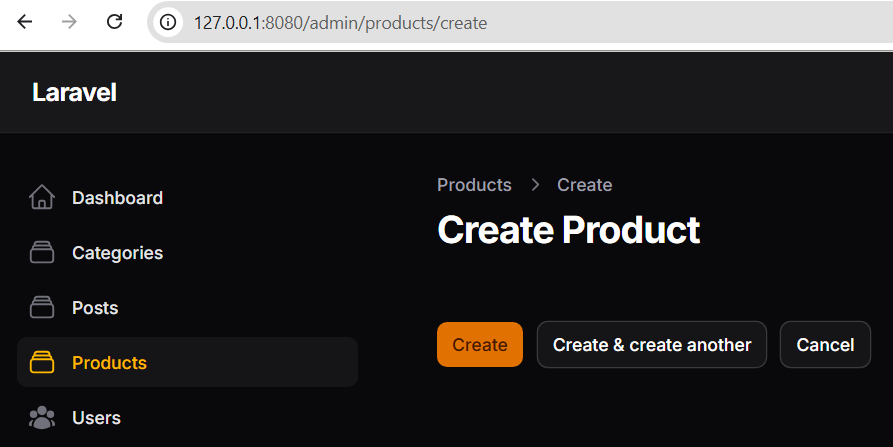

### Tampilan Create Product
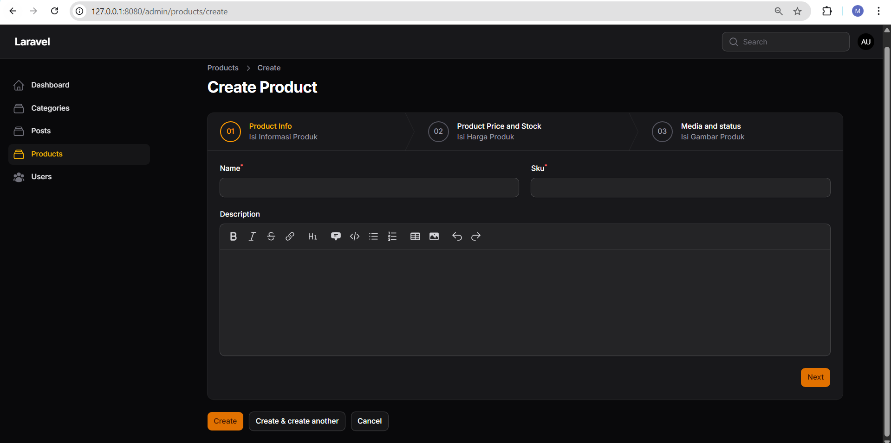

### Menghilangkan Create
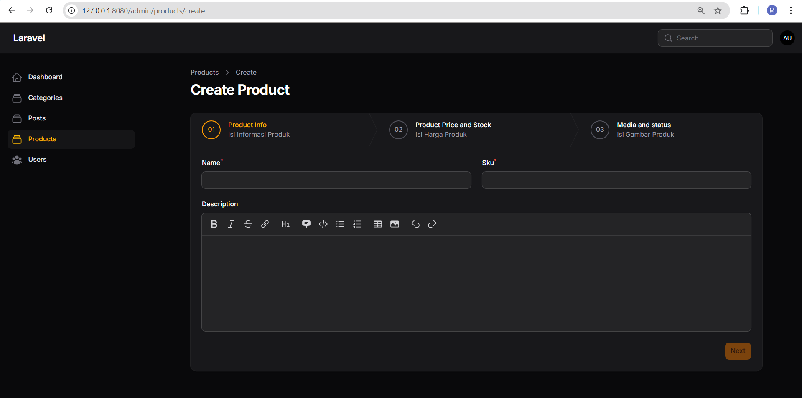

### Membuat Contoh Product
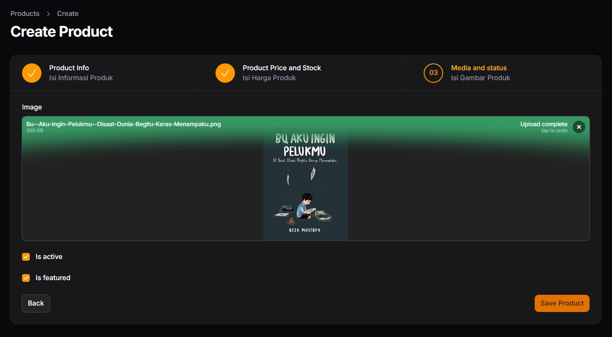

### Tampilan Input
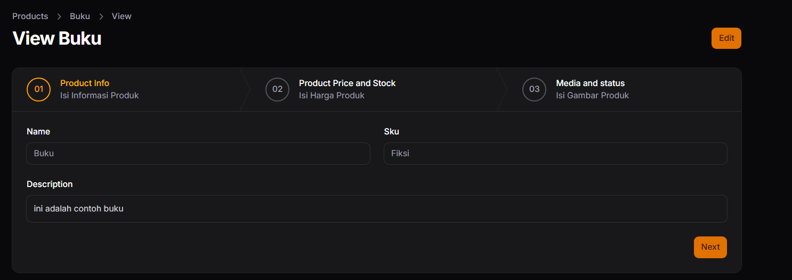

### Tampilan Database Product
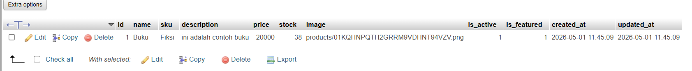

---

## M. Analisis & Diskusi

### 1. Mengapa Wizard Form lebih baik untuk form panjang?

Wizard membagi form panjang menjadi beberapa langkah yang fokus, sehingga pengguna tidak merasa overwhelming. Setiap step hanya menampilkan field yang relevan, membuat input lebih terstruktur dan mengurangi tingkat kesalahan karena pengguna bisa fokus pada satu kategori data sekaligus.

### 2. Kapan kita menggunakan skippable()?

`skippable()` digunakan ketika step tertentu bersifat opsional, misalnya promo code atau informasi tambahan. Dengan method `->skippable()`, pengguna bisa melewati step tersebut tanpa harus mengisi field, sementara step wajib (required) tetap harus diselesaikan untuk melanjutkan.

### 3. Apa kelebihan multi step dibanding single form panjang?

Multi-step form memberikan progress visual yang jelas kepada pengguna sehingga mereka tahu sudah sejauh mana. Form panjang dalam satu halaman membuat user scroll berkali-kali dan sulit melacak posisi. Multi-step juga memudahkan validasi per section dan memberikan kesempatan user untuk review sebelum submit.

### 4. Apakah wizard cocok untuk semua jenis form?

Tidak. Wizard lebih cocok untuk form kompleks dengan banyak field (10+) yang bisa dikelompokkan logis. Form sederhana dengan 3-4 field tidak perlu wizard karena akan terasa berlebihan. Pilihan penggunaan wizard bergantung pada jumlah field, kompleksitas, dan user experience yang ingin dicapai.

---

## JOBSHEET 10
### Topik: Implementasi Sorting (Ascending & Descending) pada Table Filament

---

### Sorting pada Kolom Title

### Sorting pada Kolom Slug

### Sorting pada Relasi Category

### Sorting pada Kolom Created At
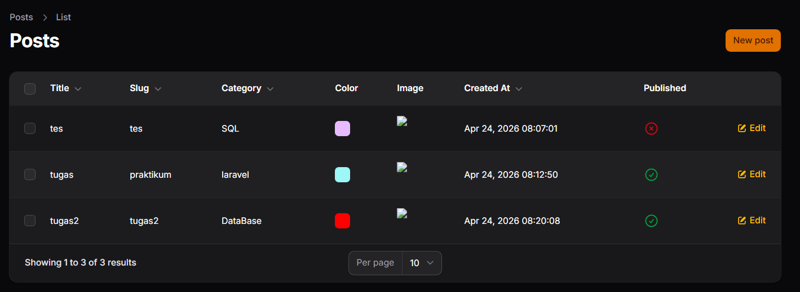

### Default Sort (Created At Descending)
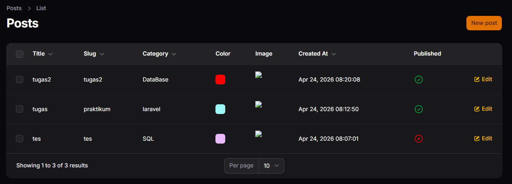

---

## L. Analisis & Diskusi

### 1. Mengapa sorting penting pada admin panel?

Sorting memungkinkan admin menemukan data yang dibutuhkan dengan cepat tanpa harus menelusuri seluruh tabel secara manual. Ketika data sudah berjumlah ratusan atau ribuan baris, mencari post terbaru atau mengurutkan berdasarkan nama menjadi sangat penting untuk efisiensi kerja. Tanpa sorting, admin terpaksa melakukan pencarian manual yang memakan waktu dan rawan kesalahan.

### 2. Apa perbedaan `sortable()` biasa dengan `defaultSort()`?

`->sortable()` memberikan kontrol kepada pengguna untuk mengklik header kolom dan memilih urutan data sesuai kebutuhannya saat itu. `->defaultSort()` sebaliknya dikendalikan oleh developer dan menentukan urutan awal tabel sebelum pengguna melakukan interaksi apapun. Keduanya bisa digunakan bersamaan, di mana `defaultSort()` menentukan tampilan awal dan `sortable()` memberi kebebasan pengguna untuk mengubah urutannya.

### 3. Mengapa kolom relasi (`category.name`) tetap bisa di-sort?

Filament secara otomatis menangani JOIN ke tabel relasi di balik layar menggunakan Eloquent. Ketika `->sortable()` ditambahkan pada `TextColumn::make('category.name')`, Filament mengetahui bahwa `category` adalah relasi dan secara otomatis membuat query dengan `JOIN` ke tabel `categories` lalu mengurutkan berdasarkan kolom `name`-nya. Developer tidak perlu menulis query manual sama sekali.

### 4. Kapan kita menggunakan `'desc'` sebagai default sort?

`'desc'` paling tepat digunakan ketika data terbaru atau terpenting perlu langsung terlihat tanpa pengguna harus melakukan klik tambahan. Contohnya pada tabel Posts di mana admin ingin melihat artikel terbaru di bagian atas, tabel log aktivitas di mana kejadian terkini lebih relevan, atau tabel order di mana transaksi terbaru harus segera ditindaklanjuti. Sebaliknya, `'asc'` lebih cocok untuk data yang secara natural dibaca dari awal seperti daftar nama atau nomor urut.

---

## M. Tugas Praktikum

### Screenshot Sorting Title Ascending (A–Z)

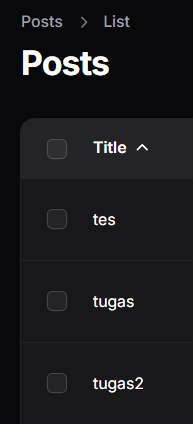

### Screenshot Sorting Title Descending (Z–A)

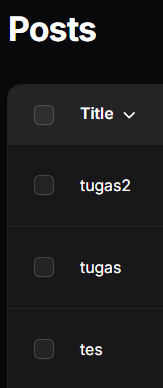

### Screenshot Sorting Date Descending (Terbaru di atas)

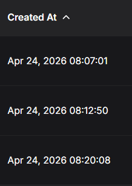

---

## Kendala dan Solusi

| No | Kendala | Solusi |
|---|---|---|
| 1 | Sorting pada `category.name` tidak bekerja dan memunculkan error query | Memastikan relasi `belongsTo(Category::class)` sudah terdefinisi dengan benar di model Post karena Filament membutuhkan relasi Eloquent untuk melakukan JOIN otomatis |
| 2 | `->defaultSort()` tidak memberikan efek apapun pada tampilan tabel | Memastikan `->defaultSort()` ditulis sebelum `->columns([...])` bukan di dalamnya, karena method ini berada di level konfigurasi table bukan di level kolom |
| 3 | Kolom `created_at` menampilkan format timestamp mentah seperti `2026-02-28 14:36:12` | Menambahkan `->dateTime()` pada kolom `created_at` agar nilainya diformat menjadi tampilan tanggal yang lebih mudah dibaca |