Nama : Marsyalia Fernanda  
NIM : 244107020133  
Kelas : TI-2F  

# Jobsheet Week 1 - Pengenalan Web Framework

### Mengubah Kode HTML
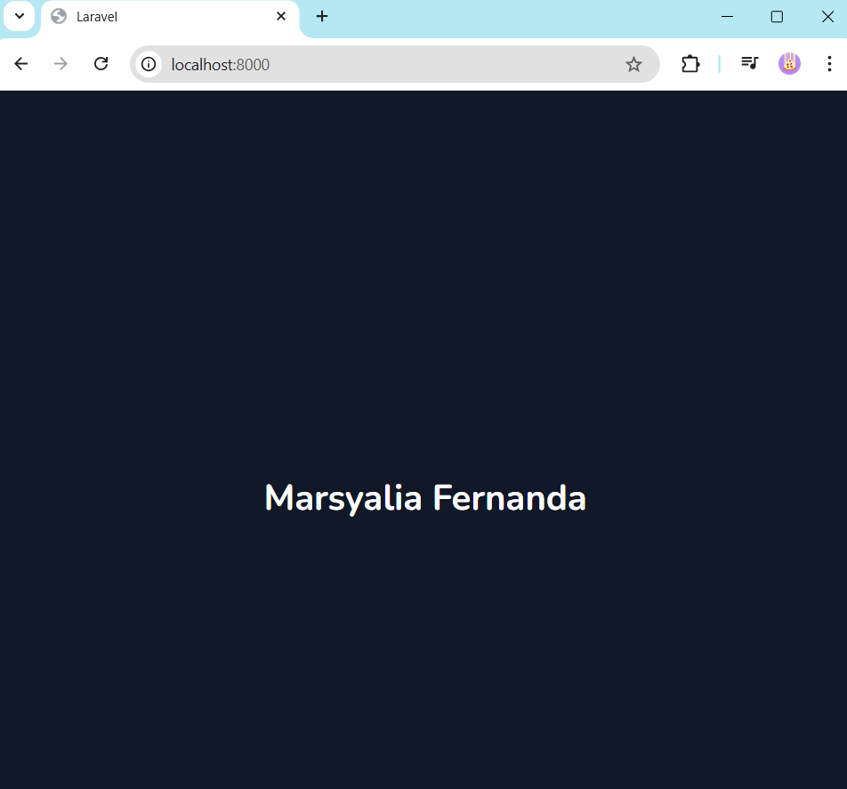

# Jobsheet Week 2 - Routing Controller View

## Praktikum 1 - Basic Routing
### Route /hello
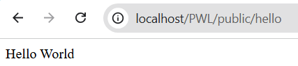  halaman yang muncul sudah sesuai dan bertuliskan "Hello World"

### Route /world
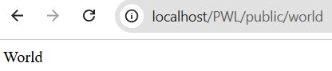  halaman yang muncul sudah sesuai dan bertuliskan "World"

### Route /
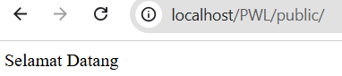  halaman muncul dengan tulisan "Selamat Datang"

### Route /about
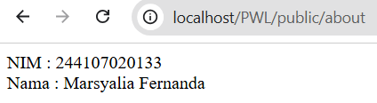 halaman memunculkan data saya

## Praktikum 1 - Route Parameters
### Route /user/{name}
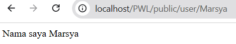  halaman menampilkan kata yang sesuai dengan parameter dan input dari url

### Route /posts/{post}/comments/{comment}
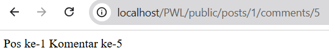  halaman menampilkan kata yang sesuai dengan parameter dan input dari url

### Route /articles/{id}
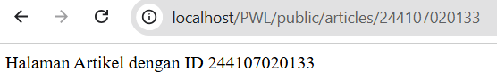  halaman menampilkan kata yang sesuai dengan parameter dan input dari url

## Praktikum 1 - Optional Parameters
### Route /user
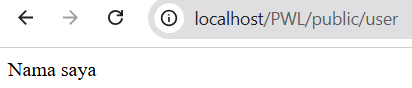  halaman menampilkan data parameter yang bersifat opsional

### Route /user function John
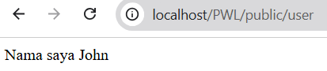  halaman menampilkan data nama yang sudah di tuliskan di function

## Praktikum 2 - Controller

### Membuat Controller
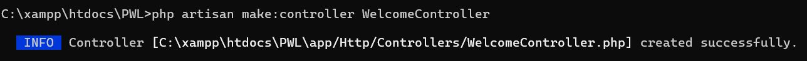

### Mengubah Route Hello
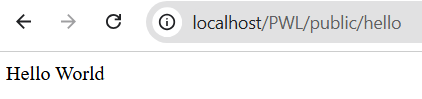

### Membuat Controller 'PageController'
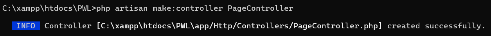

### Route /index
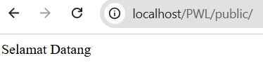

### Route about
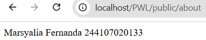

### Route articles
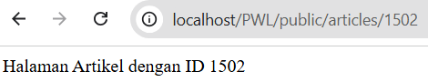

### Membuat Single Action Controller
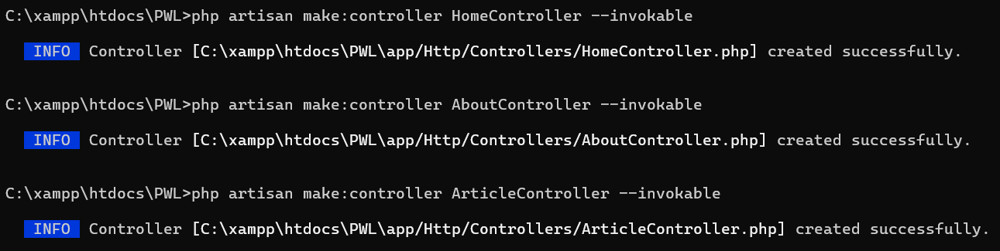

### Route /index
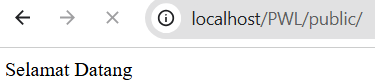

### Route about
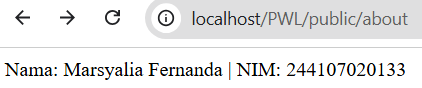

### Route articles
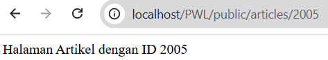

## Praktikum 2 - Resource Controller
### Membuat Controller
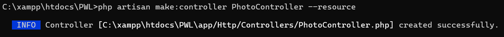

### Mengecek list route
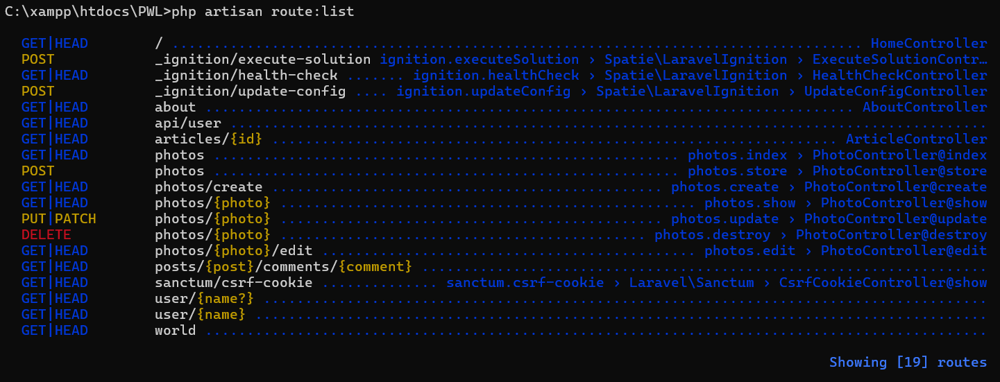

## Praktikum 3 - View
### Route /greeting
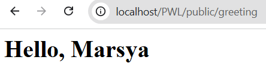

### Route view.blog
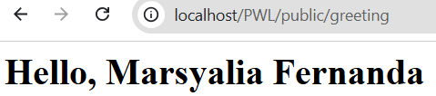

### Route view pada controller
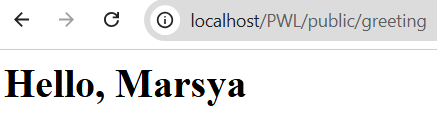

### Meneruskan data ke view
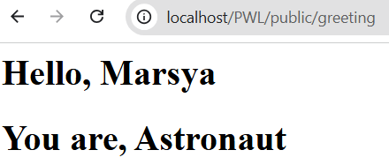