Nama : Marsyalia Fernanda  
NIM : 244107020133  
Kelas : TI-2F  

# Jobsheet Week 1 - Pengenalan Web Framework

### Mengubah Kode HTML
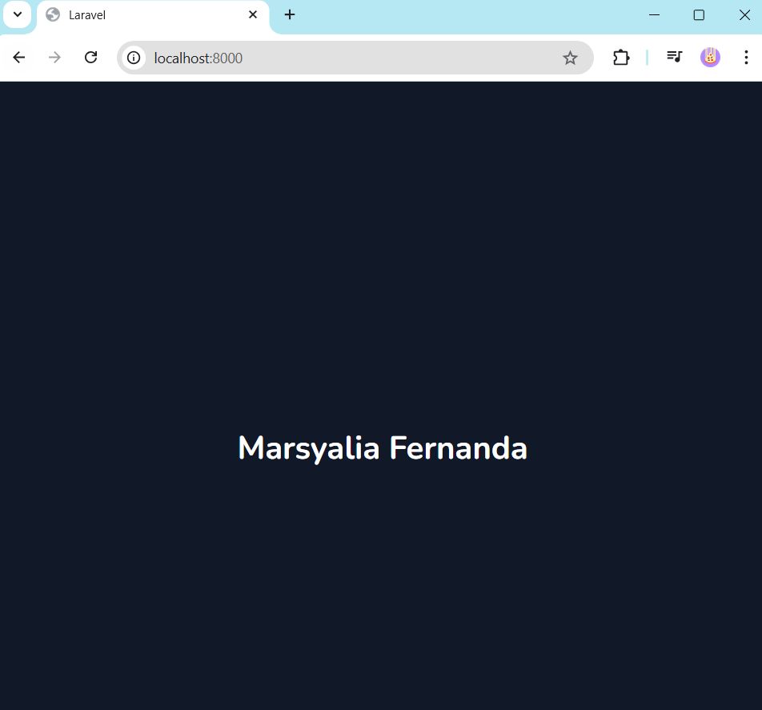

# Jobsheet Week 2 - Routing Controller View

## Praktikum 1 - Basic Routing
### Route /hello
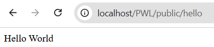  halaman yang muncul sudah sesuai dan bertuliskan "Hello World"

### Route /world
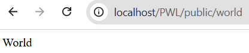  halaman yang muncul sudah sesuai dan bertuliskan "World"

### Route /
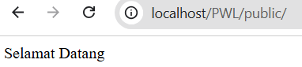  halaman muncul dengan tulisan "Selamat Datang"

### Route /about
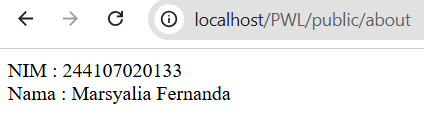 halaman memunculkan data saya

## Praktikum 1 - Route Parameters
### Route /user/{name}
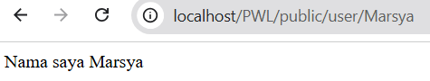  halaman menampilkan kata yang sesuai dengan parameter dan input dari url

### Route /posts/{post}/comments/{comment}
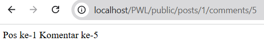  halaman menampilkan kata yang sesuai dengan parameter dan input dari url

### Route /articles/{id}
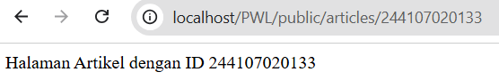  halaman menampilkan kata yang sesuai dengan parameter dan input dari url

## Praktikum 1 - Optional Parameters
### Route /user
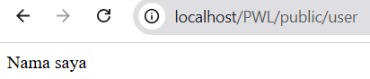  halaman menampilkan data parameter yang bersifat opsional

### Route /user function John
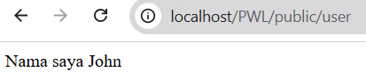  halaman menampilkan data nama yang sudah di tuliskan di function

## Praktikum 2 - Controller

### Membuat Controller
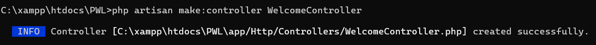

### Mengubah Route Hello
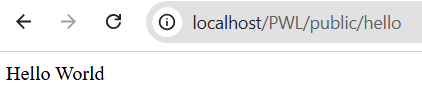

### Membuat Controller 'PageController'
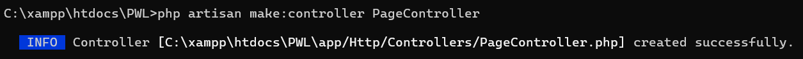

### Route /index
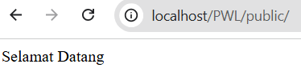

### Route about
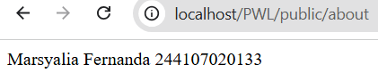

### Route articles
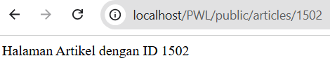

### Membuat Single Action Controller
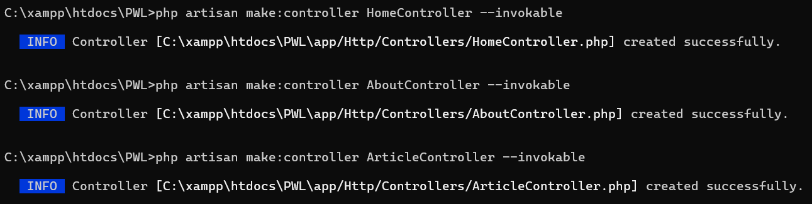

### Route /index
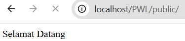

### Route about
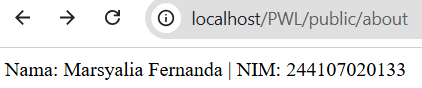

### Route articles
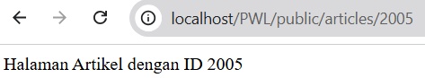

## Praktikum 2 - Resource Controller
### Membuat Controller
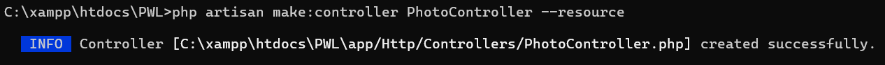

### Mengecek list route
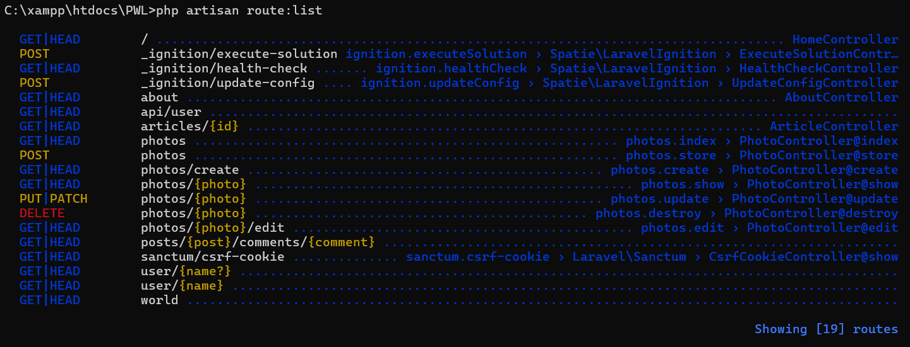

## Praktikum 3 - View
### Route /greeting
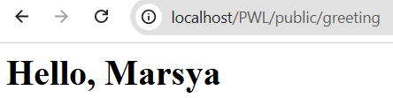

### Route view.blog


### Route view pada controller
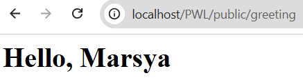

### Meneruskan data ke view
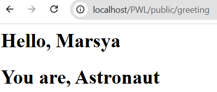

# Jobsheet Week 3 - Migration

## Praktikum 1 - Pengaturan Database
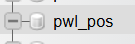
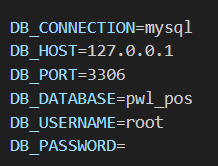

## Praktikum 2.1 - Pembuatan file migrasi tanpa relasi

### Membuat file migrasi untuk table m_level
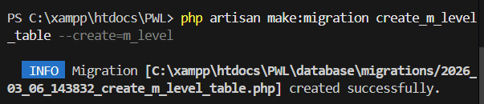
### Melakukan migrasi table m_level
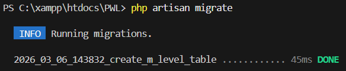
### Cek phpMyAdmin apakah table sudah ter-generate  
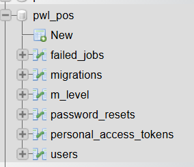  
### Buat table db dan melakukan migrasi
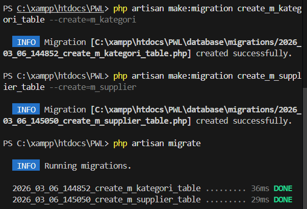  
### Cek phpMyAdmin apakah table sudah ter-generate  
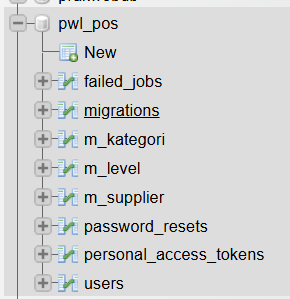

## Praktikum 2.2 - Pembuatan file migrasi dengan relasi

### Membuat file migrasi untuk table m_user
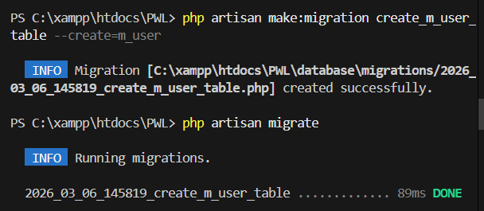
### Membuat table db dengan migration
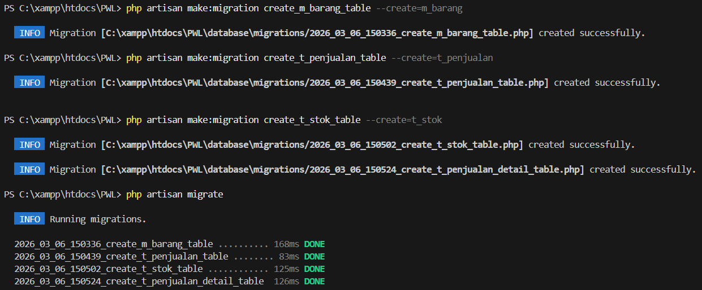
### Cek phpMyAdmin apakah table sudah ter-generate 
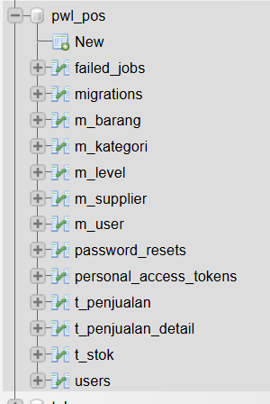

## Praktikum 3 - Membuat file seeder

### Membuat file LevelSeeder dan menjalankannya
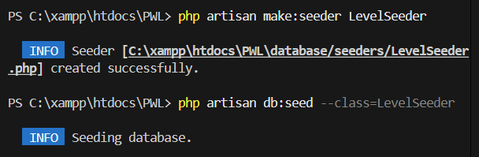
### Tampilan table m_level
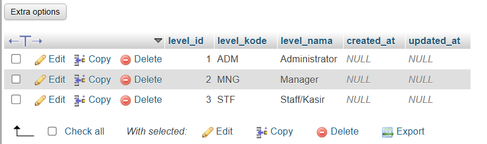
### Membuat file UserSeeder dan menjalankannya
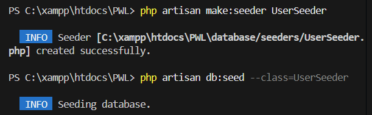
### Tampilan table m_user
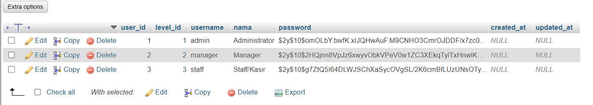
### Contoh data no.10
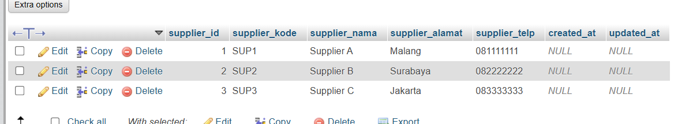

# G. Penutup

Jawablah pertanyaan berikut sesuai dengan pemahaman materi di atas:

## 1. Pada Praktikum 1 - Tahap 5, apakah fungsi dari APP_KEY pada file setting .env Laravel?
**Jawaban:**
APP_KEY adalah kunci enkripsi aplikasi Laravel yang digunakan untuk mengenkripsi data sensitif seperti session, cookies, dan password. Fungsi utamanya adalah:
- Mengenkripsi data yang disimpan di session dan cookies
- Mengamankan data yang di-hash menggunakan `Hash::make()`
- Memastikan integritas data aplikasi
- Key ini harus unik dan rahasia untuk setiap aplikasi Laravel

## 2. Pada Praktikum 1, bagaimana kita men-generate nilai untuk APP_KEY?
**Jawaban:**
Nilai APP_KEY di-generate menggunakan perintah Artisan:
```
php artisan key:generate
```
Perintah ini akan membuat random key berupa string 32 karakter (base64 encoded) dan secara otomatis menyimpannya di file `.env` pada variable `APP_KEY`.

## 3. Pada Praktikum 2.1 - Tahap 1, secara default Laravel memiliki berapa file migrasi? dan untuk apa saja file migrasi tersebut?
**Jawaban:**
Secara default Laravel memiliki 4 file migrasi:
1. `2014_10_12_000000_create_users_table.php` - Membuat tabel users
2. `2014_10_12_100000_create_password_resets_table.php` - Tabel untuk reset password
3. `2019_08_19_000000_create_failed_jobs_table.php` - Tabel untuk job yang gagal
4. `2019_12_14_000001_create_personal_access_tokens_table.php` - Tabel untuk API token

## 4. Secara default, file migrasi terdapat kode `$table->timestamps();`. Apa tujuan/output dari fungsi tersebut?
**Jawaban:**
Fungsi `$table->timestamps()` membuat dua kolom otomatis pada tabel:
- `created_at` - Menyimpan timestamp saat data dibuat
- `updated_at` - Menyimpan timestamp saat data terakhir diperbarui

Kedua kolom bertipe `TIMESTAMP` dan Laravel secara otomatis mengelola nilainya.

## 5. Pada File Migrasi, terdapat fungsi `$table->id()`. Tipe data apa yang dihasilkan dari fungsi tersebut?
**Jawaban:**
Fungsi `$table->id()` menghasilkan kolom dengan tipe data `BIGINT UNSIGNED AUTO_INCREMENT` yang berfungsi sebagai primary key. Kolom ini secara otomatis:
- Auto-increment (bertambah 1 setiap insert)
- Bersifat primary key (unik dan tidak null)
- Bernilai positif (unsigned)
- Default nama kolom adalah `id`

## 6. Apa bedanya hasil migrasi pada table m_level, antara menggunakan `$table->id();` dengan menggunakan `$table->id('level_id');`?
**Jawaban:**
Perbedaannya adalah pada **nama kolom**:
- `$table->id()` - Membuat kolom dengan nama default `id`
- `$table->id('level_id')` - Membuat kolom dengan nama custom `level_id`

Kedua-duanya tetap BIGINT UNSIGNED AUTO_INCREMENT sebagai primary key, hanya nama kolom yang berbeda.

## 7. Pada migrasi, Fungsi `->unique()` digunakan untuk apa?
**Jawaban:**
Fungsi `->unique()` digunakan untuk membuat constraint UNIQUE pada kolom, yang berarti:
- Setiap nilai dalam kolom harus unik (tidak boleh ada duplikat)
- Contoh: `$table->string('level_kode', 10)->unique()` memastikan tidak ada dua level_kode yang sama
- Membantu mencegah data duplikat dan menjaga integritas data

## 8. Pada Praktikum 2.2 - Tahap 2, kenapa kolom `level_id` pada tabel m_user menggunakan `$table->unsignedBigInteger('level_id')`, sedangkan kolom `level_id` pada tabel m_level menggunakan `$table->id('level_id')`?
**Jawaban:**
Karena:
- `$table->id('level_id')` pada tabel m_level membuat kolom sebagai PRIMARY KEY dengan auto-increment
- `$table->unsignedBigInteger('level_id')` pada tabel m_user membuat kolom sebagai FOREIGN KEY yang mereferensi m_level
- FOREIGN KEY tidak boleh auto-increment, hanya berisi nilai yang referensi ke tabel lain
- Tipe data sama-sama BIGINT UNSIGNED untuk konsistensi relasi

## 9. Pada Praktikum 3 - Tahap 6, apa tujuan dari Class Hash? dan apa maksud dari kode program `Hash::make('1234');`?
**Jawaban:**
**Tujuan Class Hash:**
- Mengenkripsi password dan data sensitif menggunakan algoritma bcrypt
- Menyediakan method untuk hashing dan verifikasi password

**Maksud `Hash::make('1234')`:**
- Mengenkripsi string '1234' menggunakan bcrypt
- Menghasilkan hash string panjang yang tidak bisa di-reverse
- Hasil berbeda setiap kali di-hash meskipun input sama
- Digunakan untuk menyimpan password terenkripsi di database

## 10. Pada Praktikum 4 - Tahap 3/5/7, pada query builder terdapat tanda tanya (?), apa kegunaan dari tanda tanya (?) tersebut?
**Jawaban:**
Tanda tanya `(?)` adalah **parameter placeholder** yang digunakan untuk:
- Menyimpan nilai parameter secara terpisah dari query
- Mencegah SQL Injection attacks
- Contoh: `DB::select('SELECT * FROM users WHERE id = ?', [1])` - nilai 1 disimpan terpisah
- Membuat query lebih aman dan terstruktur
- Array kedua berisi nilai-nilai yang akan menggantikan placeholder `?`

## 11. Pada Praktikum 6 - Tahap 3, apa tujuan penulisan kode `protected $table = 'm_user';` dan `protected $primaryKey = 'user_id';`?
**Jawaban:**
- **`protected $table = 'm_user'`** - Mendefinisikan nama tabel yang digunakan oleh model (jika nama tabel berbeda dari nama model)
- **`protected $primaryKey = 'user_id'`** - Mendefinisikan nama kolom primary key dari tabel (jika berbeda dari default `id`)
- Keduanya memastikan Eloquent ORM mengarah ke tabel dan kolom yang benar

## 12. Menurut kalian, lebih mudah menggunakan mana dalam melakukan operasi CRUD ke database (DB Façade / Query Builder / Eloquent ORM)? jelaskan!
**Jawaban:**
Setiap memiliki kelebihan:

**DB Façade / Query Builder:**
- Lebih fleksibel untuk query kompleks
- Lebih cepat untuk operasi sederhana
- Kontrol penuh atas query SQL
- Cocok untuk raw query dan operasi spesifik

**Eloquent ORM:**
- Lebih mudah dan intuitif (object-oriented)
- Lebih sedikit kode yang ditulis
- Otomatis menangani relasi antar tabel
- Lebih aman dari SQL Injection
- Lebih mudah untuk CRUD standar

**Kesimpulan secara personal:** Saya lebih mudah menggunakan **Eloquent ORM** karena sintaknya lebih clean, automatic relationship handling, dan lebih sesuai untuk operasi CRUD biasa. Namun untuk query kompleks atau raw query, Query Builder lebih fleksibel.

# Jobsheet Week 4 - Model dan Eloquent ORM

## Praktikum 1 - $fillable

### Membuat file model UserModel.php
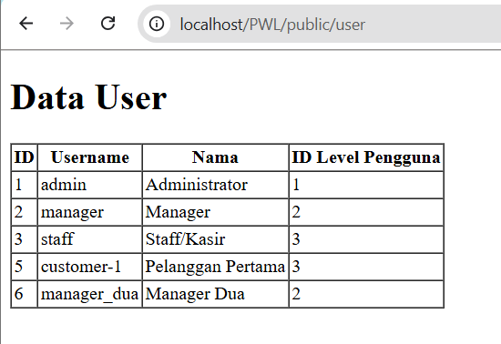

### Membuat file controller UserController.php dengan method index
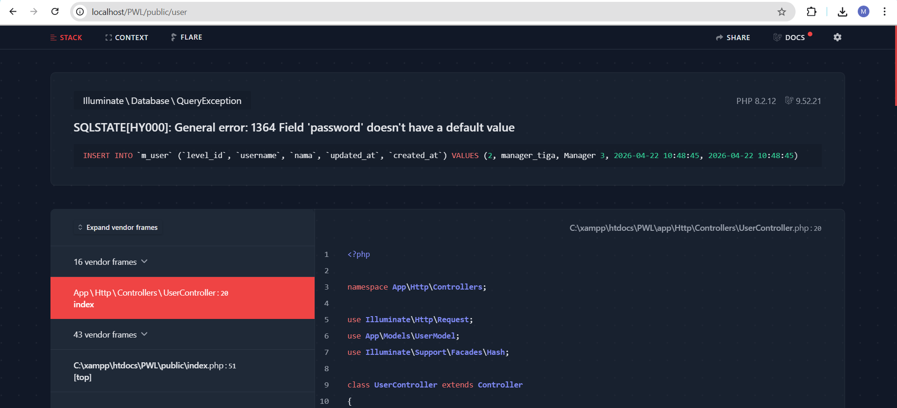

## Praktikum 2 - Retrieving Single Models

### Praktikum 2.1 - Retrieving Single Models

### Hasil nomor 3


### Hasil nomor 5
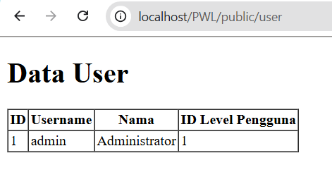

### Hasil nomor 9
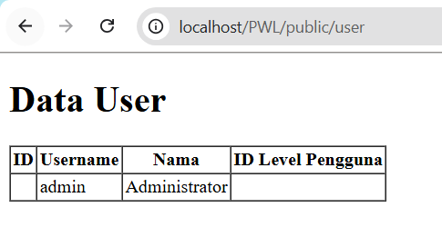

### Hasil nomor 11 (notfound)
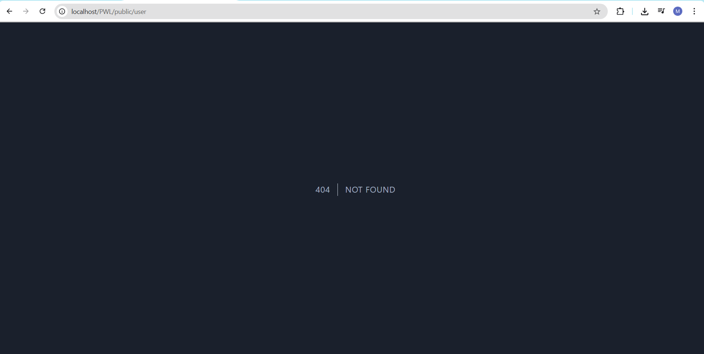

### Praktikum 2.2 - Not Found Exceptions

#### Ubah file controller UserController.php menggunakan method findOrFail()
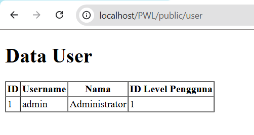

#### Ubah file controller UserController.php menggunakan method where() dengan firstOrFail()
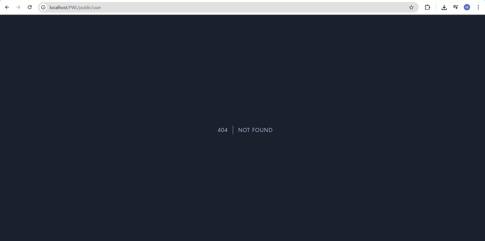

### Praktikum 2.3 - Attribute Changes

#### Hasil nomor 1
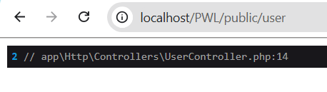

### Hasil nomor 3


### Praktikum 2.4 - Retrieving Aggregates

#### Hasil nomor 3
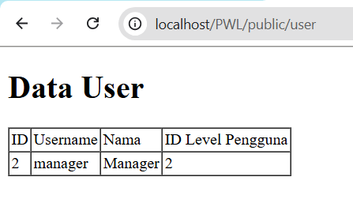

#### Hasil nomor 5
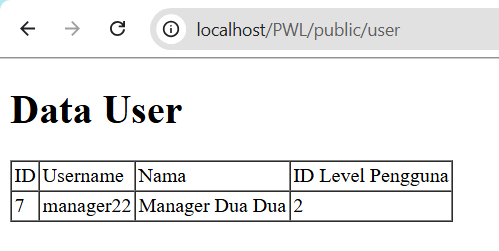

#### Hasil nomor 7
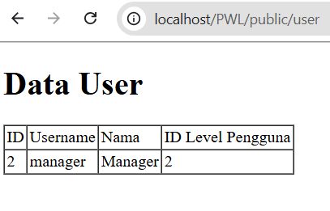

#### Hasil nomor 9
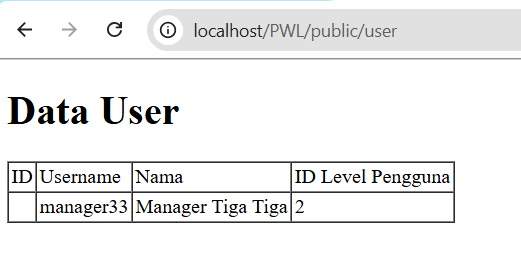

#### Hasil nomor 10
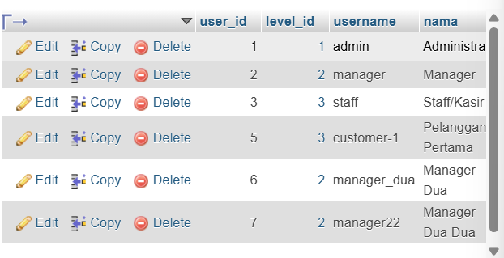
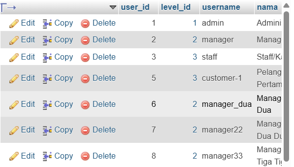

### Praktikum 2.5 - Retrieving or Creating Models

#### Hasil nomor 2
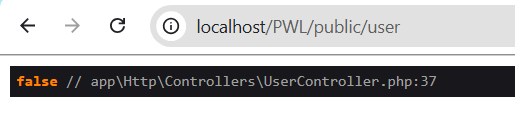

#### Hasil nomor 4
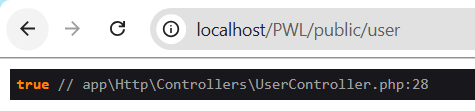

### Praktikum 2.6 - Create, Read, Update, Delete (CRUD)

#### Hasil nomor 3
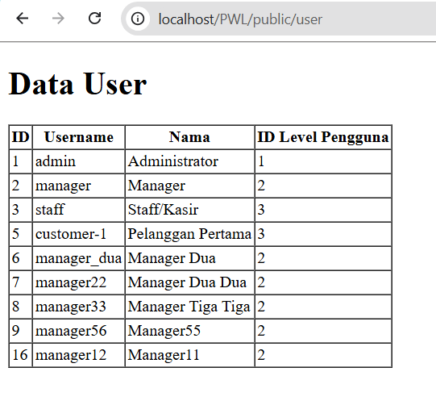

#### Hasil nomor 4
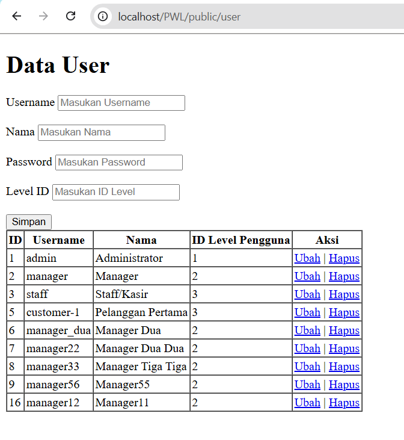

### Praktikum 2.7 - Relationships

#### Hasil nomor 7
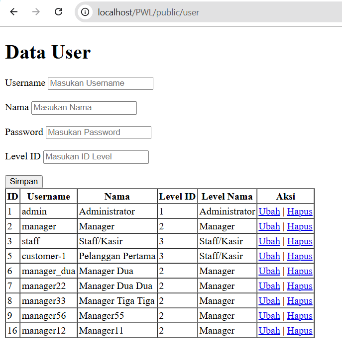